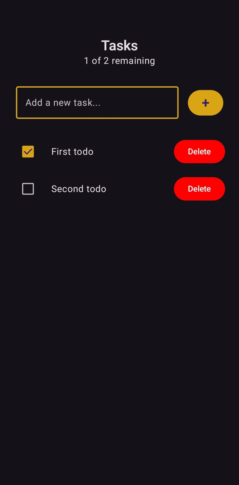

# Android Todo App

An Android todo application using Jetpack Compose with real-time updates via a Convex backend.



## Description

This Android Todo app demonstrates modern Android development practices using Jetpack Compose for the UI and Convex as a real-time backend service. Users can create, view, and mark todos as complete, with all changes instantly reflected on all connected clients.

## Technologies & Libraries

- **Jetpack Compose** - Modern declarative UI toolkit for Android
- **Material Design 3** - Latest Material Design system with dynamic color support
- **Convex** - Real-time backend-as-a-service with automatic synchronization
- **Kotlin Coroutines** - Asynchronous programming for smooth UI operations
- **Kotlinx Serialization** - JSON serialization for data models
- **Android Edge-to-Edge** - Full-screen immersive experience

### External Dependencies

- [Convex Android SDK](https://docs.convex.dev/quickstart/android) - Real-time backend integration
- [Jetpack Compose BOM](https://developer.android.com/jetpack/compose/bom) - Compose dependency management
- [Kotlinx Serialization](https://github.com/Kotlin/kotlinx.serialization) - JSON serialization library

## Project Structure

```
AndroidTodo/
├── app/
│   ├── src/
│   │   ├── main/
│   │   │   ├── java/com/example/androidtodo/
│   │   │   │   ├── domain/           # Data models and business logic
│   │   │   │   ├── ui/
│   │   │   │   │   ├── composables/  # Reusable UI components
│   │   │   │   │   ├── layouts/      # Screen layout compositions
│   │   │   │   │   ├── theme/        # Material Design 3 theming
│   │   │   │   │   └── views/        # Main screen implementations
│   │   │   │   └── MainActivity.kt   # Application entry point
│   │   │   ├── res/                  # Android resources
│   │   │   └── AndroidManifest.xml
│   │   ├── androidTest/              # Instrumented tests
│   │   └── test/                     # Unit tests
│   └── build.gradle.kts              # App-level build configuration
├── assets/                           # Project assets including screenshots
├── build.gradle.kts                  # Project-level build configuration
├── gradle/                           # Gradle wrapper
├── gradle.properties                 # Gradle configuration
└── settings.gradle.kts               # Project settings
```

### Directory Descriptions

- **`domain/`** - Contains the `Todo` data class with Kotlinx serialization annotations for backend communication
- **`ui/composables/`** - The `TodoItem`, `TodoList`, and `RemainderText` reusable components
- **`ui/layouts/`** - Screen layout compositions that organize the overall UI structure
- **`ui/theme/`** - Material Design 3 theming with dynamic color support and custom typography
- **`ui/views/`** - The main screen implementation `TodoView` with real-time data binding

## Architecture Highlights

The app follows an architecture pattern focused on separation of concerns.

- **Presentation Layer**: Jetpack Compose UI components with Material Design 3
- **Domain Layer**: Data models with serialization support
- **Data Layer**: Convex backend integration for real-time data synchronization

The app leverages CompositionLocal for dependency injection of the Convex client, enabling real-time updates through reactive subscriptions to backend mutations and queries.
